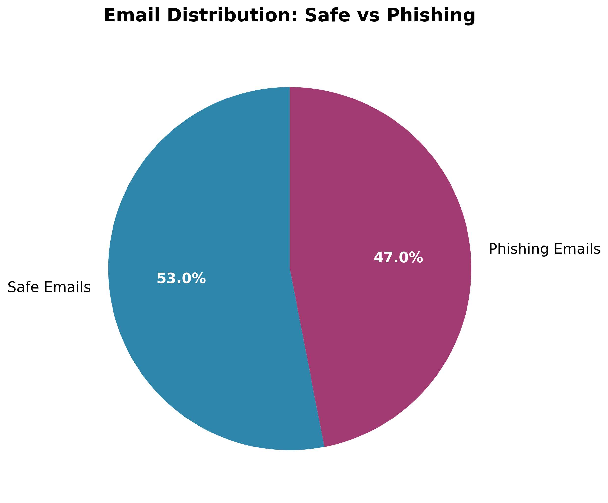
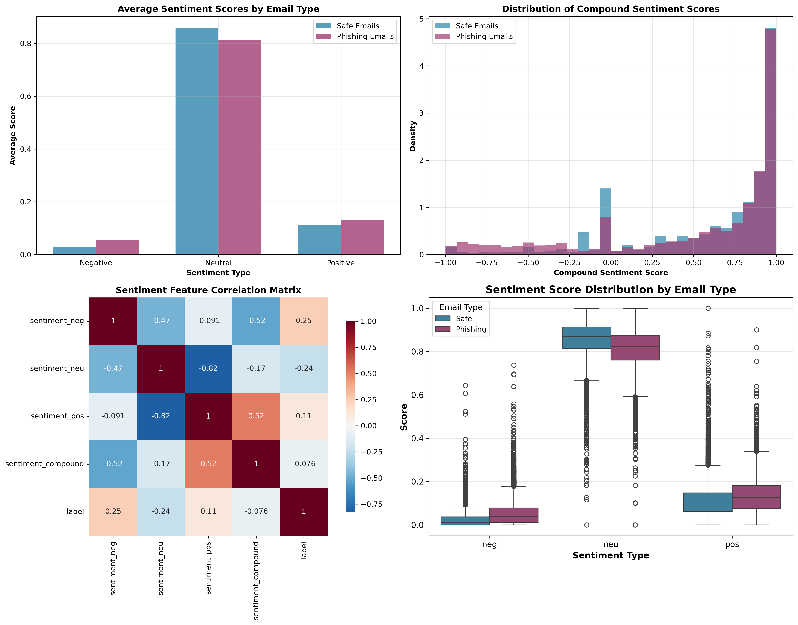
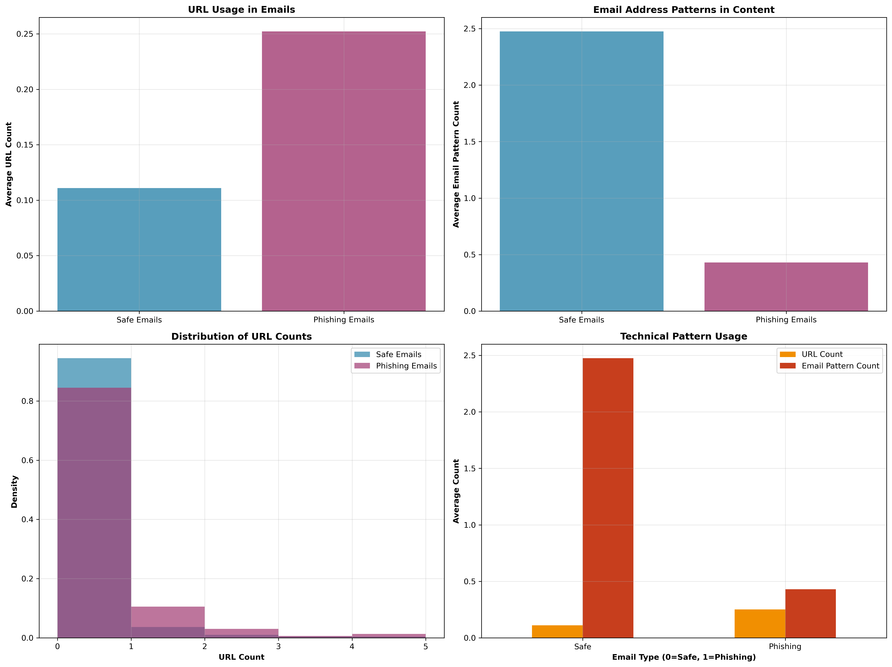

# Data Exploration

## Overview

This folder is designated for initial data exploration scripts and notebooks to understand the structure and characteristics of our phishing email dataset before conducting formal analysis.

## Purpose

Data exploration helps us:

- Understand dataset structure and quality
- Identify patterns and anomalies in the data
- Inform feature engineering decisions
- Guide analysis strategy development
- Validate data cleaning effectiveness

## Expected Explorations

Future explorations in this folder should focus on:

### Dataset Overview

- Email distribution (phishing vs. safe)
- Text length distributions
- Missing data patterns
- Data quality assessment

### Preliminary Pattern Analysis

- Word frequency distributions
- Basic sentiment patterns
- Email structure characteristics
- Temporal patterns (if timestamp data available)

### Feature Understanding

- Distribution of extracted linguistic features
- Correlation between features
- Outlier identification
- Feature stability across different email types

## Usage Notes

- Scripts in this folder should be exploratory and experimental
- Use this folder for initial insights before formal analysis in `/4_data_analysis`
- All exploration should use datasets from `/1_datasets`
- Document interesting findings that inform the analysis strategy

**Note**: Current explorations are integrated into the main analysis pipeline in `/4_data_analysis`. This folder is prepared for future exploration work or alternative analysis approaches.

Our datset contains 1551 phishing and 1497 safe emails.Below we visually summarize the total class phishing and safe emails

Other important things we will be looking at in order to better understand our data is the frequency of words

And the existence of URL is another aspect we aim to analyze in phishing vs non phishing emails

