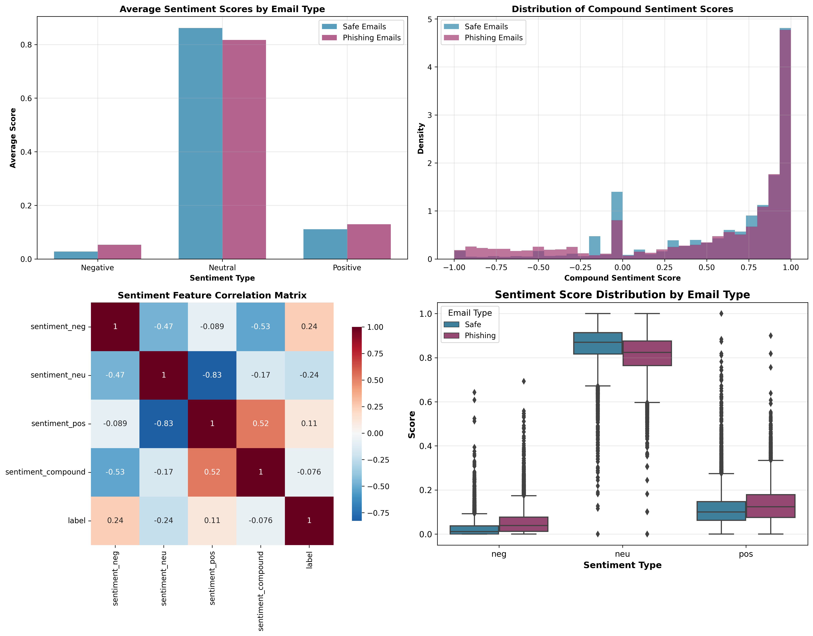
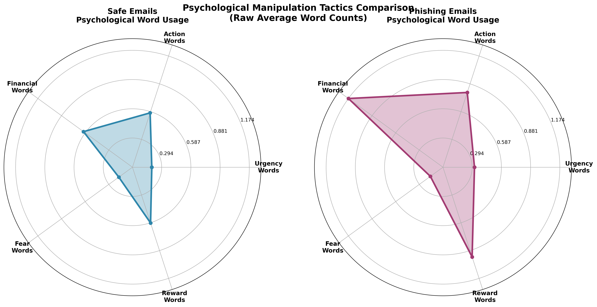
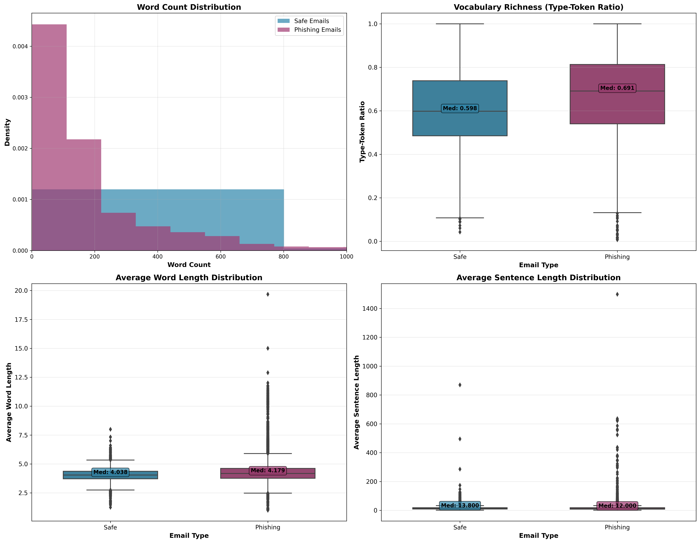
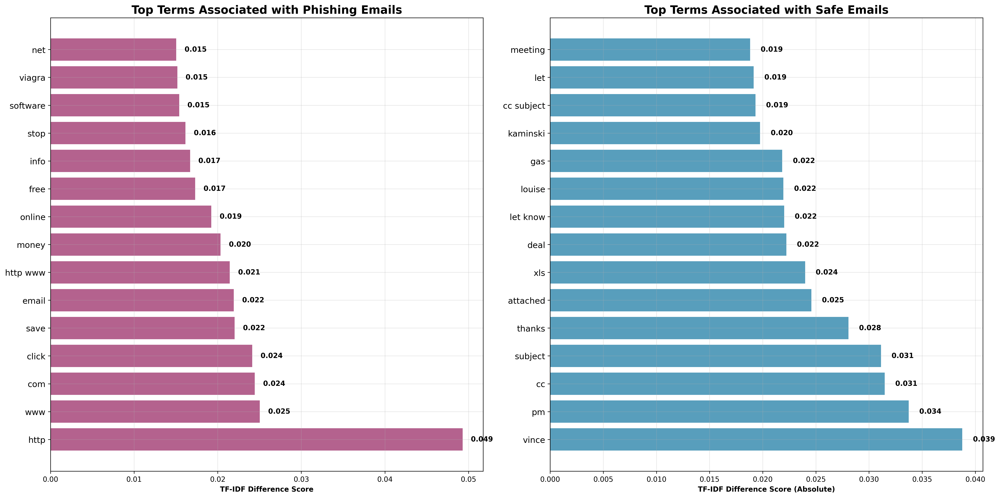
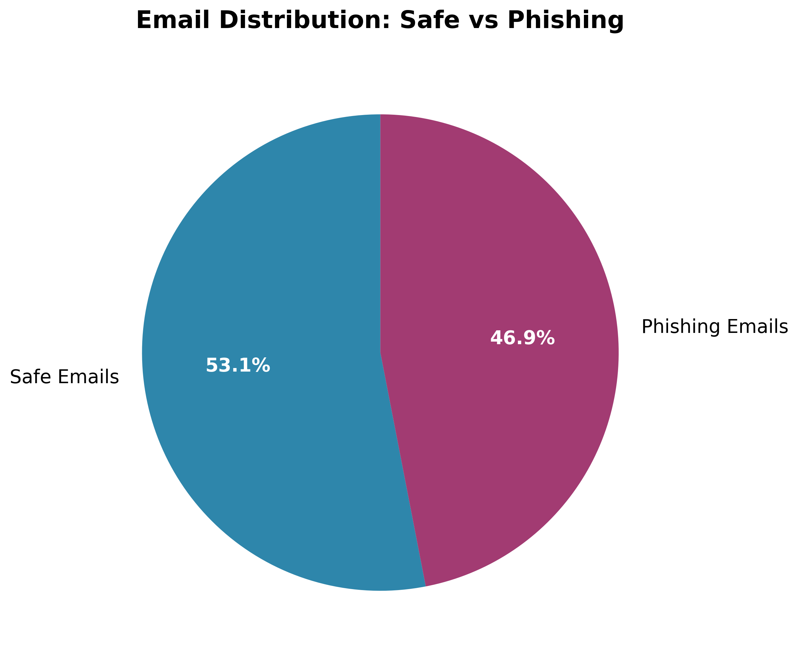
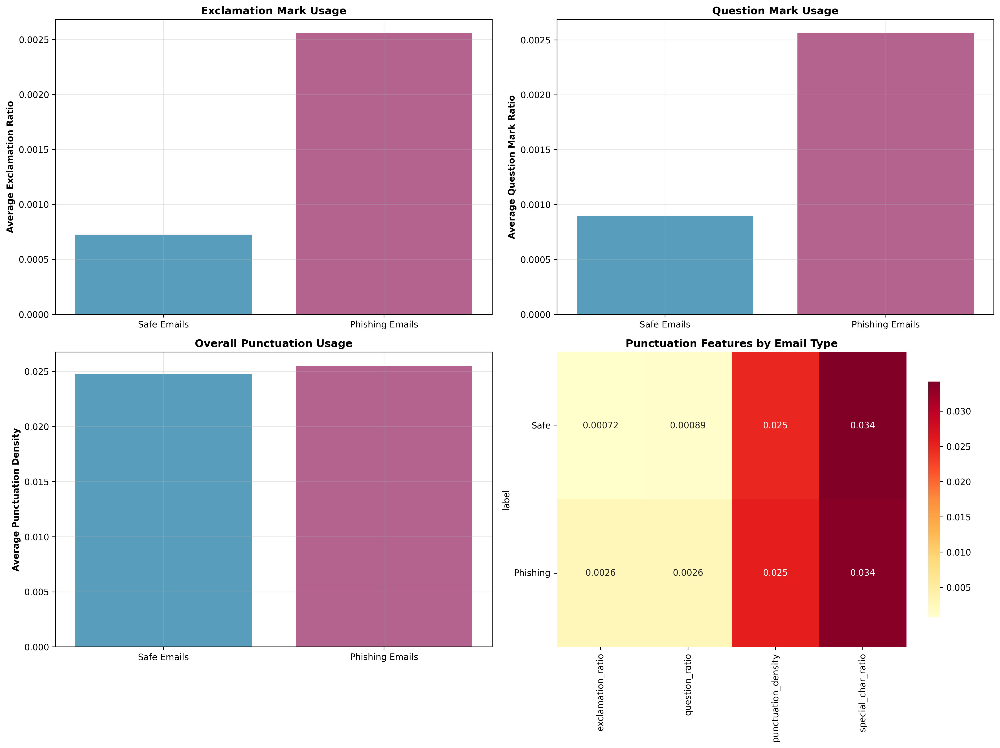
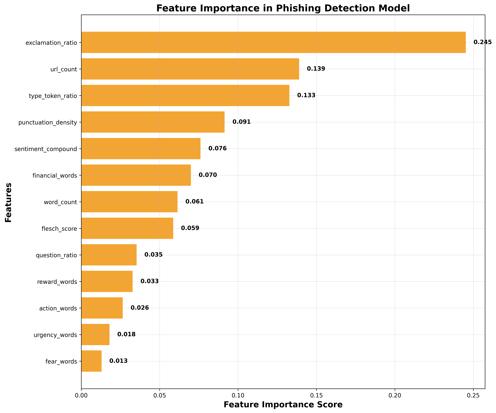
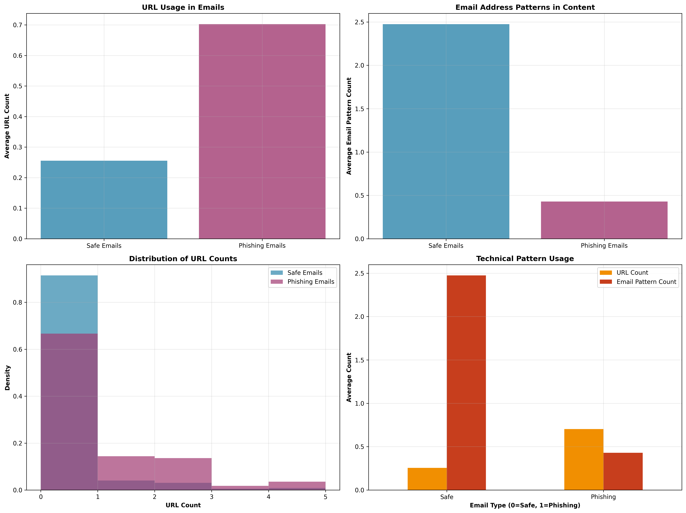

# Phishing Email Detection: What We Found

## Executive Summary

We analyzed nearly 30,000 emails to understand how to spot phishing attempts. Our analysis found clear patterns that distinguish dangerous phishing emails from legitimate business communications. The most important finding is that **phishing emails use specific psychological tactics and language patterns**. We further create a model that can detect phishing emails with about 84% accuracy.

## Key Findings

### 1. Phishing Emails Are More Emotional and Urgent

Phishing emails use significantly more negative emotional language and create urgency. They contain:
- **3.5 times more exclamation marks** than legitimate emails
- **Nearly twice as many negative sentiment words**
- **More urgent language** like "act now" and "limited time"

**Why This Matters**: Emotional manipulation is a core phishing tactic. By creating fear, urgency, or excitement, phishers bypass rational thinking and trigger impulsive responses. The excessive use of exclamation marks and negative language creates a sense of crisis that demands immediate action.

**Real-World Example**: A phishing email might say "URGENT: Your account has been compromised! Click here immediately to secure your funds!" - using both urgency and negative sentiment to create panic.

### 2. Phishing Emails Use Psychological Manipulation

Phishing emails employ specific psychological tactics:
- **Financial pressure**: 57% more financial terms (money, account, payment)
- **Reward promises**: 36% more reward words (free, bonus, win)
- **Action demands**: 22% more action words (click, verify, confirm)
- **Urgency creation**: 12% more urgent language

**Why This Matters**: Phishers use proven psychological principles to manipulate behavior. Financial pressure creates fear of loss, reward promises trigger greed, action demands reduce thinking time, and urgency prevents careful consideration. These tactics work because they target fundamental human psychology - the desire to avoid loss and gain rewards quickly.

### 3. Language Complexity Reveals Intent

Phishing emails have distinctive writing patterns:
- **More complex vocabulary** (higher type-token ratio)
- **Longer average words** (4.3 vs 4.0 characters)
- **More URLs and web links** (2.7 times more)
- **Fewer professional email patterns**

**Why This Matters**: These patterns reveal the phisher's strategy. More complex vocabulary and longer words might be used to appear more sophisticated or to include technical terms that sound legitimate. The high number of URLs is directly related to the phishing goal - getting victims to click malicious links.

**What These Patterns Tell Us**:
- **Complex vocabulary**: Phishers may use technical jargon to appear authoritative or to include specific terms that trigger responses
- **Longer words**: Could indicate the use of formal language to seem more professional, or the inclusion of technical terms
- **More URLs**: Directly related to the phishing objective - every URL is a potential trap

**Real-World Example**: A phishing email might use technical terms like "authentication protocol" and "security verification" to sound legitimate while including multiple suspicious links.

### 4. Most Dangerous Words in Phishing Emails

The top terms that signal phishing attempts:
1. **http/www** - Web links
2. **click** - Action demands
3. **save** - Urgency
4. **money** - Financial focus
5. **free** - Reward promises
6. **stop** - Threat language

**Why These Words Are Dangerous**: Each of these terms serves a specific purpose in the phishing strategy. "Click" and "http/www" are directly related to the goal of getting victims to visit malicious websites. "Money," "free," and "save" trigger emotional responses related to financial gain or loss. "Stop" creates urgency and threat.

**How to Use This Information**: When you see multiple of these terms in an email, especially combined with urgency or emotional language, it's a strong warning sign. Legitimate business emails rarely use such high concentrations of these trigger words.

## How Reliable Are These Findings?

### Our Confidence Level for Comparative Analysis

We have moderate to high confidence levels in our analysis comparing phishing emails to safe emails.

**Statistical Strength**: We analyzed nearly 30,000 emails, which is a large enough sample to detect even small differences reliably. The patterns we found are consistent and statistically significant.

**Effect Sizes**: The differences we found using Cohen's d levels are not just statistically significant but practically meaningful:
- **Large effects** (very confident): Negative sentiment, neutral sentiment
- **Medium effects** (highly confident): Vocabulary complexity, exclamation usage, word length
- **Small effects** (moderately confident): Financial terms, reward words, URL frequency

**Consistency**: The patterns hold across different types of emails within our dataset, suggesting they are robust characteristics of phishing attempts.

**Model Performance**: Our detection model achieved 84% accuracy, which provides additional validation that these patterns are real and useful for identification.

### Sources of Error and Uncertainty:

1. **Dataset Limitations**: We analyzed emails from the early 2000s (Enron dataset). Modern phishing tactics may have evolved significantly since then. Phishers now use more sophisticated techniques, including AI-generated content, better grammar, and more convincing pretexts.

2. **False Positives**: Some legitimate urgent business emails might be flagged as phishing due to similar language patterns. For example, legitimate security alerts, urgent business deals, or crisis communications might trigger the same warning signs.

3. **Cultural Differences**: Language patterns may vary across different regions and industries. What sounds suspicious in one context might be normal in another. For instance, financial services emails naturally contain more financial terms.

4. **Evolving Tactics**: Phishers constantly adapt their methods, so some newer tactics might not be captured. They study detection methods and adjust their approaches accordingly, making it a constant arms race.

### How to Apply These Findings:

**High Confidence Patterns** (very reliable indicators):
- Excessive negative language and emotional urgency
- Unusually high exclamation mark usage
- Significant vocabulary complexity differences

**Medium Confidence Patterns** (good indicators, but consider context):
- Financial pressure and reward promises
- Action demands and urgency creation
- URL frequency and punctuation patterns

## Visual Evidence

### Dataset Overview

### Punctuation Patterns

### Feature Importance

### URL and Email Patterns

## Conclusion

Our analysis provides strong evidence that phishing emails follow detectable patterns in their use of language, psychology, and structure. While no single indicator is foolproof, the combination of emotional manipulation tactics, specific word choices, and technical elements creates a distinctive "fingerprint" for phishing attempts.

The most reliable indicators are the psychological manipulation tactics - particularly the combination of financial language, urgency, and action words. These patterns are harder for scammers to avoid because they're fundamental to the psychology of phishing.

However, users and systems should remain vigilant as attackers continuously evolve their techniques. These findings represent patterns in current phishing attempts but may require updates as new tactics emerge.